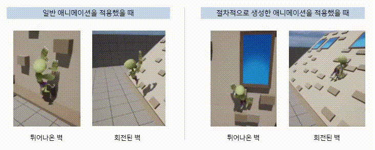
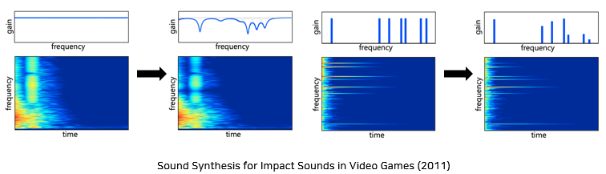

# 2023-2 Game Content Capstone Design - Team1. 푸바오야행복을조
- [전윤민](https://github.com/ThisIsSimple)  
- [유다인](https://github.com/dain6978)  
- [이정민](https://github.com/ketchupmustardmayonnaise)

  개발 기간: 23.09.11 - 23.12.11  
  개발 도구: Unreal Engine 5.1.1

## 게임 설명
  
플레이어가 갇힌 연구실에 좀비가 침공합니다. 플레이어는 게임을 시작하자마자 주어진 맵 내에서 생성되는 물건들을 좀비에게 던져 방어해야 합니다.

## 기술 설명
#### 1. 딥러닝을 이용한 자동 맵 생성
[ATISS: Autoregressive Transformers for Indoor Scene Synthesis (2021)](https://research.nvidia.com/labs/toronto-ai/ATISS/)  
  
방 유형과 바닥 도면을 입력받아 임의로 실내 환경을 생성하는 딥러닝 모델  
- 약 4,000개의 실내 평면도와 가구 배치에 대한 데이터를 바탕으로 학습을 진행하였으며
- Python으로 생성된 방을 Socket Communication을 이용하여 Unreal Engine과 연동

#### 2. Procedural Animation
  
Inverse Kinematics를 이용하여, 좀비가 벽을 오를 때 물리적으로 타당하고 자연스럽게 할 수 있도록 함   
Unreal Engine의 Control Rig 이용  

#### 3. Sound Synthesis
[Sound Synthesis for Impact Sounds in Video Games (2011)](https://arxiv.org/abs/2303.16897)  
  
SFTF(Short-Time Fourier Transform) 및 필터를 적용하여 피격 시 다양한 사운드 클립 생성  
